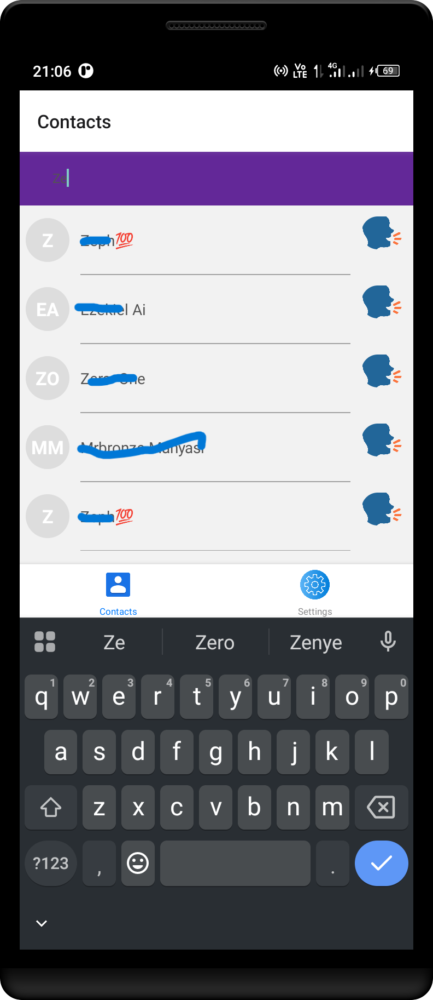
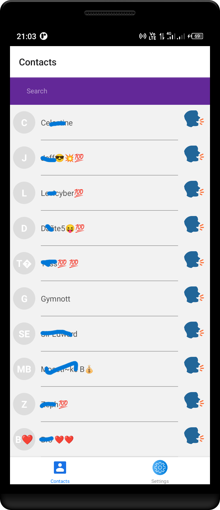

# Real-Time Call Transcription App

Introducing the Real-Time Call Transcription App, a React Native application designed to transcribe live call conversations effortlessly. This app leverages the power of React Native to provide a seamless and intuitive user experience across both iOS and Android platforms.

## Features

- **Real-Time Transcription**: Automatically converts spoken words into text during live calls.
- **Cross-Platform Support**: Works seamlessly on both iOS and Android devices.
- **User-Friendly Interface**: Intuitive design for easy navigation and usage.
- **High Accuracy**: Utilizes advanced speech recognition technology for accurate transcriptions.

## Getting Started

To get started with the Real-Time Call Transcription App, follow these steps:

1. **Clone the Repository**: Clone this repository to your local machine.
2. **Install Dependencies**: Run `npm install` to install all necessary dependencies.
3. **Run the App**: Use `npx react-native run-android` or `npx react-native run-ios` to launch the app on your device or emulator.

## Technologies Used

- **React Native**: For building the cross-platform mobile application.
- **Speech Recognition API**: For real-time transcription of call conversations.
- **Redux**: For state management.

## Contributing

We welcome contributions! Feel free to open issues, submit pull requests, or suggest improvements.

## License

This project is licensed under the MIT License. See the [LICENSE](LICENSE) file for more details.

Experience the future of communication with our Real-Time Call Transcription App! 📞🗣️